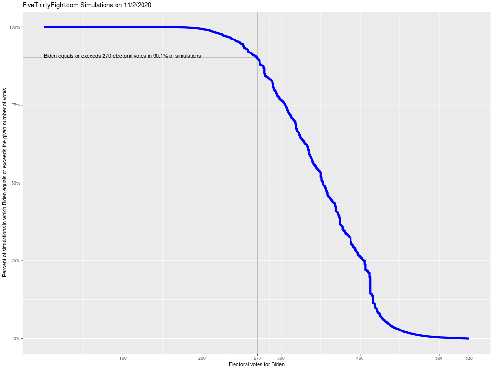

Comments to [mash@econs.umass.edu](mailto:mash@econs.umass.edu)

**Every Outcome in Our Simulations**, one of the panels of
  [https://projects.fivethirtyeight.com/2020-election-forecast/](https://projects.fivethirtyeight.com/2020-election-forecast/),
  plots the spiky probability density function and a smoothed version
  of the probability density function for the 40,000 electoral-vote
  simulations that FiveThirtyEight conducts using estimated
  probability of victory for each state based on state polling and
  other factors, including interstate correlation.

This upside-down cumulative distribution function resolves the problem
of interpreting the spikiness of the probability density function
(reflecting the discreteness of both State electoral vote counts and
states of the world) or the imprecision of the smoothed version.

Using the upside-down cumulative distribution function

- For a given number of Biden electoral votes, the plotted function
  reports the probability (the share of simulations) in which Biden's
  electoral vote total exceeded the given number.

- For example, as of 09/07/2020, Biden has an essentially 100% chance
  of getting at least 150 electoral votes, a 71% probability of
  getting at least the 270 electoral votes needed to win, a roughly
  60% chance of getting at least 300 votes, but only around a 20%
  chance of getting 400 or more electoral votes.

The R code

- reads the Model outputs data from Five Thirty Eight which reports
  the estimated probability of each possible electoral-vote outcome.

- computes a cumulative distribution function from the probability
  density function with a density at each electoral vote outcome (from
  0 to 538 electoral votes for Trump), which is one less the
  cumulative distribution function for votes for Biden.

- estimates the probability of Biden's votes exceeding 270, the victory
  threshold

- plots the probability of Biden exceeding the given number of
  electoral votes for each outcome from 0 to 538

- annotates the plot with the 270 probability and several guide lines

Access to the FiveThirtyEight data

- R script attempts to read the data from
  [https://projects.fivethirtyeight.com/2020-general-data/presidential_ev_probabilities_2020.csv](https://projects.fivethirtyeight.com/2020-general-data/presidential_ev_probabilities_2020.csv)

- If that fails, at the bottom of
  [https://projects.fivethirtyeight.com/2020-election-forecast/](https://projects.fivethirtyeight.com/2020-election-forecast/),
  look for "Download the data: Polls Model outputs" and click "Model
  outputs" and unzip the data into the "fivethirtyeight" subdirectory
  of the project directory